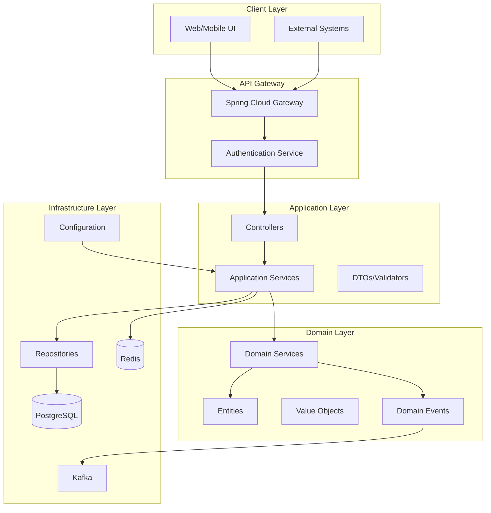

# Loan Origination System - Architecture Assessment Report

## Executive Summary

The current loan origination system demonstrates a solid foundation with clear separation of concerns and modern technology choices. However, the architecture appears to be in an early development stage with several critical components missing. The project shows good potential but requires significant implementation work to become a fully functional system.

## Current Architecture Analysis

### Technology Stack
- **Framework**: Spring Boot 4.0.2 (Note: This version appears incorrect - Spring Boot 4 doesn't exist; likely meant to be 3.x or 2.x)
- **Language**: Java 21
- **Database**: PostgreSQL with JPA/Hibernate
- **Caching**: Redis integration
- **Messaging**: Kafka for event-driven architecture
- **Security**: Spring Security
- **Build Tool**: Maven
- **Containerization**: Docker Compose for local development
- **Libraries**: Lombok for boilerplate reduction

### Project Structure
```
src/main/java/com/example/los/
├── application/          # Application layer (currently empty)
│   ├── dto/             # Data Transfer Objects (empty)
│   └── service/         # Application services (empty)
├── controller/          # Web controllers (empty)
├── domain/              # Domain layer
│   ├── auth/           # Authentication entities
│   ├── entity/         # Core domain entities
│   ├── enum/           # Enumerations (empty)
│   ├── policy/         # Business policies/rules
│   ├── reference/      # Reference data
│   ├── service/        # Domain services (empty)
│   └── valueobject/    # Value objects (empty)
└── infrastructure/     # Infrastructure layer
    ├── config/         # Configuration (empty)
    └── repository/     # Data repositories (empty)
```

## Strengths of Current Architecture

1. **Clear Layered Structure**: The project follows a clean, layered architecture pattern with clear separation between domain, application, and infrastructure layers.

2. **Modern Technology Choices**: Good selection of technologies including Spring Boot, PostgreSQL, Redis, and Kafka for a scalable microservices-ready foundation.

3. **Domain-Driven Design Approach**: The domain layer is well-organized with entities representing core business concepts (Customer, LoanApplication, Product, etc.).

4. **Containerization Ready**: Docker Compose configuration shows good DevOps practices for local development.

5. **Comprehensive Entity Model**: The domain entities cover essential loan origination concepts:
   - Customer management (`TCustomer`)
   - Loan products (`MProduct`)
   - Loan applications (`TLoanApplication`)
   - Approval workflow (`TLoanApproval`)
   - Collateral management (`TLoanCollateral`)
   - Disbursement tracking (`TLoanDisbursement`)
   - Repayment scheduling (`TLoanRepayment`, `TLoanRepaymentSchedule`)

## Critical Architectural Gaps

### 1. **Missing Application Layer Components**
- No controllers for REST API endpoints
- No application services implementing use cases
- No DTOs for API request/response objects
- No exception handling or validation mechanisms

### 2. **Missing Infrastructure Layer**
- No repository interfaces or implementations
- No database configuration or connection setup
- No Redis/Kafka configuration or integration
- No security configuration

### 3. **Incomplete Domain Layer**
- Domain services missing (business logic layer)
- Value objects not implemented
- Enumerations directory exists but empty
- No domain events or aggregates defined

### 4. **Configuration Issues**
- `application.properties` only contains application name
- No database connection configuration
- No security configuration
- No external service configurations

### 5. **Missing Business Logic**
- No loan approval workflow implementation
- No interest calculation logic
- No fee calculation services
- No credit scoring or risk assessment
- No document management integration

## Scalability and Maintainability Concerns

### Positive Aspects:
- **Event-Driven Ready**: Kafka integration allows for scalable event-driven architecture
- **Caching Strategy**: Redis integration supports performance optimization
- **Modular Structure**: Clear separation enables independent scaling of components

### Concerns:
1. **Database Design**: Entities use foreign key IDs instead of JPA relationships, limiting ORM capabilities
2. **Missing Transactions**: No transaction management implemented
3. **No API Documentation**: Missing OpenAPI/Swagger documentation
4. **Limited Error Handling**: No global exception handling strategy
5. **Missing Monitoring**: No logging, metrics, or health checks configured

## Architectural Recommendations

### High Priority (Foundation)
1. **Implement Complete Layered Architecture**:
   - Create REST controllers with proper HTTP methods
   - Implement application services for use cases
   - Add repository interfaces with JPA implementations
   - Create DTOs with validation annotations

2. **Database Configuration**:
   - Add complete `application.properties` with database connection
   - Configure connection pooling
   - Add Flyway/Liquibase for database migrations

3. **Security Implementation**:
   - Configure Spring Security with JWT authentication
   - Implement role-based authorization
   - Add password encryption

### Medium Priority (Business Logic)
4. **Domain Service Implementation**:
   - Create loan application processing service
   - Implement approval workflow engine
   - Add interest and fee calculation services
   - Create credit scoring module

5. **API Design**:
   - Implement RESTful API design patterns
   - Add OpenAPI documentation
   - Create comprehensive error responses
   - Implement request/response validation

6. **Event-Driven Architecture**:
   - Implement Kafka producers/consumers for domain events
   - Create event handlers for asynchronous processing
   - Design event schemas for loan lifecycle events

### Low Priority (Enhancements)
7. **Monitoring and Observability**:
   - Add logging with structured format
   - Implement metrics collection
   - Add health checks and readiness probes
   - Configure distributed tracing

8. **Testing Strategy**:
   - Implement unit tests for domain logic
   - Add integration tests for repositories
   - Create API contract tests
   - Add performance/load testing

## Proposed Architecture Diagram



## Implementation Roadmap

### Phase 1: Foundation (2-3 weeks)
1. Complete application.properties configuration
2. Implement repository layer with JPA
3. Create basic REST controllers for CRUD operations
4. Add Spring Security with basic authentication
5. Implement DTOs with validation

### Phase 2: Core Business Logic (3-4 weeks)
1. Implement loan application processing workflow
2. Create approval engine with state machine
3. Add interest and fee calculation services
4. Implement document management
5. Create comprehensive test suite

### Phase 3: Advanced Features (4-6 weeks)
1. Implement event-driven architecture with Kafka
2. Add Redis caching for performance
3. Create reporting and analytics module
4. Implement batch processing for repayments
5. Add monitoring and observability

### Phase 4: Production Readiness (2-3 weeks)
1. Implement comprehensive error handling
2. Add API documentation
3. Configure production deployment
4. Performance optimization
5. Security hardening

## Risk Assessment

### High Risk Areas:
1. **Incomplete Security**: Missing authentication/authorization poses security risks
2. **No Error Handling**: System failures may not be properly handled
3. **Missing Transactions**: Data integrity issues possible
4. **No Testing**: Quality assurance gaps

### Mitigation Strategies:
1. Implement security early in development cycle
2. Add comprehensive error handling and logging
3. Use Spring's transaction management
4. Adopt test-driven development approach

## Conclusion

The current architecture provides a good foundation with modern technology choices and clear separation of concerns. However, it's essentially a skeleton structure missing critical implementation components. The project needs significant development work to transform from an architectural blueprint into a functional loan origination system.

The recommended approach is to systematically implement the missing layers while maintaining the clean architectural separation already established. Focus should be on building a solid foundation with proper security, error handling, and testing before implementing complex business logic.

**Overall Assessment**: Good architectural foundation with significant implementation gaps. With proper execution of the recommended improvements, this can become a robust, scalable loan origination system.